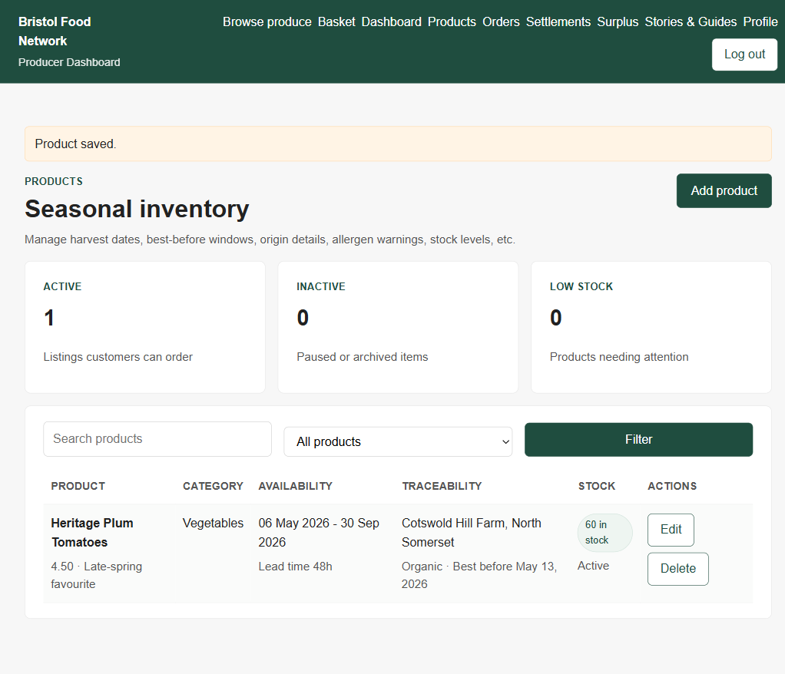
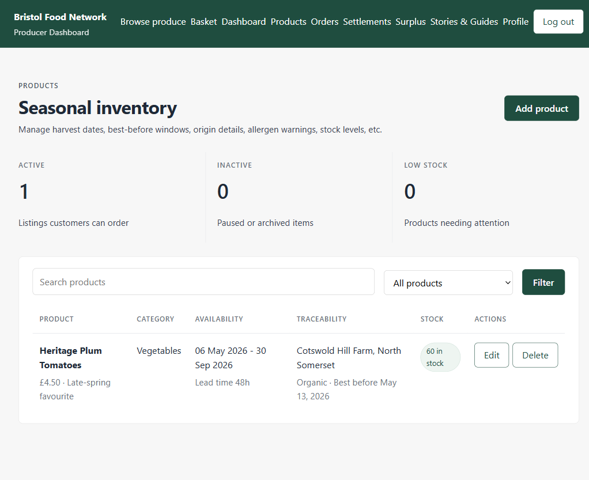
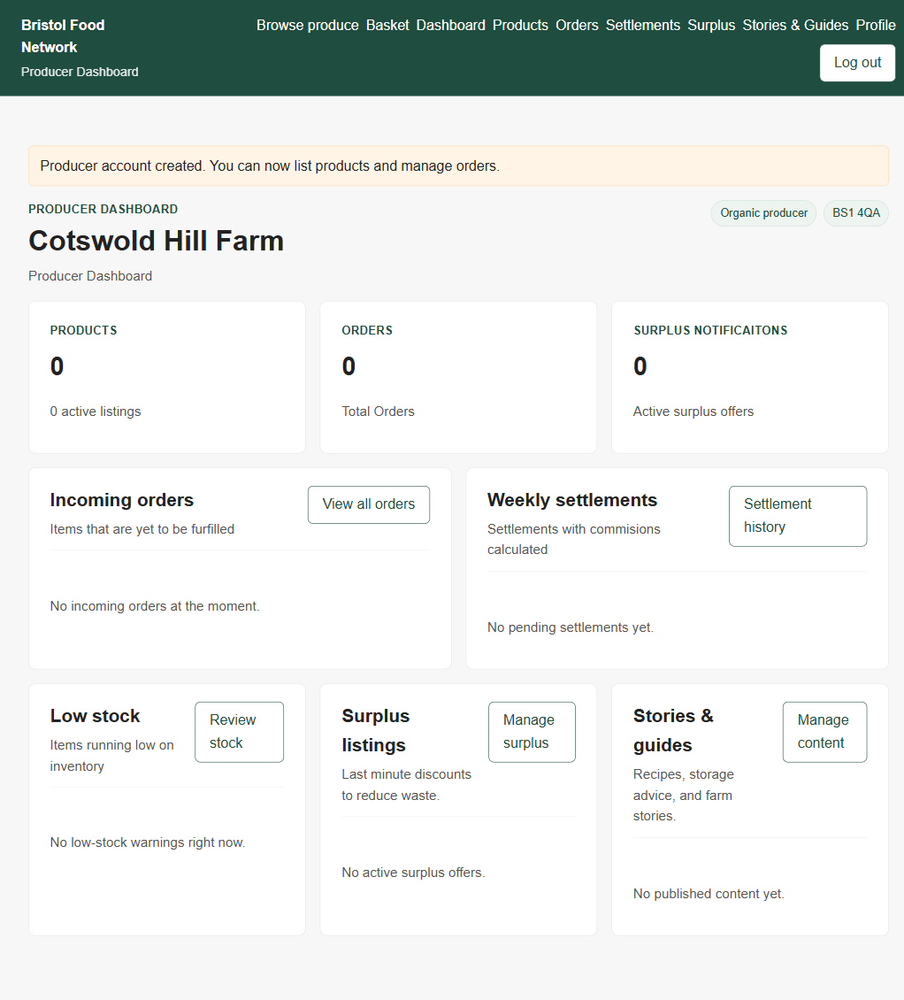
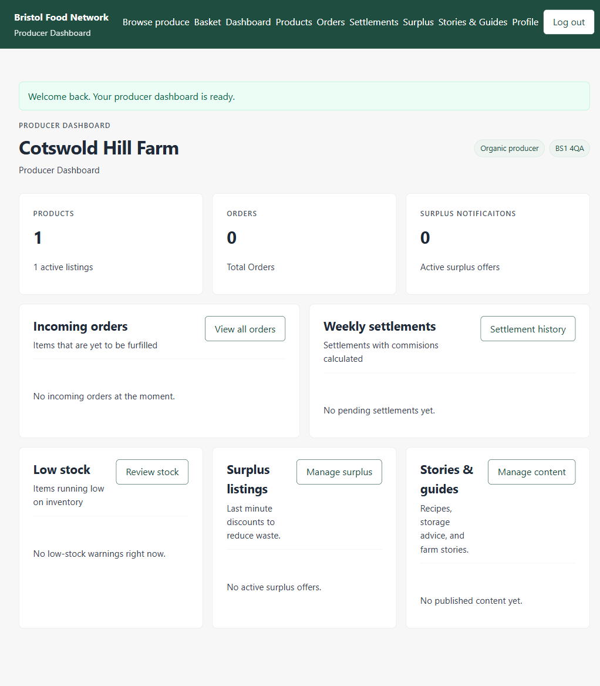

# Producer Product List redesign

Visual polish pass on the producer-facing Products page (`/producer/products/`).
Goal: tighten typography, fix layout bugs (stretched filter button, stacked
action buttons), and reduce the all-cards-everywhere feel of the stats row.
A small number of changes cascade to every producer page.

Date: 2026-05-06
Branch: `feature/customer-template-consistency`

---

## At a glance

### Producer Products list

| Before | After |
|---|---|
|  |  |

### Producer Dashboard (cascade verification + green-success toast)

| Before | After |
|---|---|
|  |  |

The dashboard's stat cards intentionally stayed boxed — the de-card treatment
is opt-in via the `.stat-row` class on the Products page only. The mint-green
toast confirms the success / warning / error split is wired through.

---

## What changed and why

| Region | Before | After | Reason |
|---|---|---|---|
| Body font | `sans-serif` (browser fallback — Arial on Win) | full system stack starting at `ui-sans-serif` | consistent metrics across producer machines |
| Body / meta colour | both `#555` | `#374151` body, `#6b7280` meta | restore real hierarchy between primary and secondary text |
| `.eyebrow` | bold green, 0.04em tracking | semibold neutral grey, 0.09em tracking | brand green now reserved for the primary CTA, not every label |
| h1 in `.page-intro` | default tracking | `letter-spacing: -0.02em` | display headings need negative tracking to read intentional |
| `.page-intro` flex | `align-items: flex-start` | `align-items: center` | "Add product" button no longer floats above the h1 |
| Stats row | three `.stat-card` boxes (white bg, border) | hairline-separated KPIs over the page background (scoped via `.stat-row`) | the table card below was competing with three smaller card silhouettes |
| Stat number | 1.8rem bold | 2.25rem semibold, `-0.03em` tracking, `tabular-nums` | numbers align in a column when counts grow past 9 |
| Filters row | `.filters > * { flex: 1 1 12rem }` stretched the green Filter button to ~300px | search field flexes, button is `flex: 0 0 auto` | the button is secondary; it should not look like the page's primary action |
| Table headers | 0.85rem `#555` (same colour as body) | 0.72rem semibold `#6b7280`, 0.09em tracking | reads as scaffolding, not content |
| Row padding | 0.75rem vertical | 1rem vertical | two-line cells stop feeling crammed |
| Edit / Delete pair | wrapped to a vertical stack at the column's natural width | inline pair (`flex-wrap: nowrap`, `white-space: nowrap`) | one row of buttons reads as a single action group |
| Stock cell | always echoed "Active" subtext | nothing for active rows; a `Paused` pill only when inactive | "active" is already conveyed by the stat above; only deviations need column space |
| Price line | `4.50 · …` | `£4.50 · …` | matches the `£` prefix used on the create/edit form |
| Toast styling | every flash message rendered amber (warning) | `success` / `warning` / `error` / `info` split via `{{ message.tags }}` | "Product saved" was reading like an error |

---

## Files touched

- [`core/templates/core/base.html`](../../core/templates/core/base.html) — global stylesheet block plus the messages template
- [`core/templates/core/product_list.html`](../../core/templates/core/product_list.html) — markup-only changes for the Products page

No view, model, migration, URL, or static-asset changes.

---

## Patch reference

Ten ordered patches were applied. Items marked **cascaded** affect every
producer page; items marked **page-scoped** only affect the Products list.

### Patch 1 — body font + neutral text hierarchy (cascaded)

`base.html`, `body` rule:

```css
body {
    font-family: ui-sans-serif, system-ui, -apple-system, BlinkMacSystemFont,
                 "Segoe UI Variable", "Segoe UI", Roboto, "Helvetica Neue", Arial, sans-serif;
    color: #1f2937;
    -webkit-font-smoothing: antialiased;
    /* …unchanged: margin, background */
}
```

And split body vs meta colours:

```css
p { color: #374151; }
.meta { color: #6b7280; }
```

(Replaces the old combined `.meta, p { color: #555; }`.)

### Patch 2 — eyebrow + headline tightening (cascaded)

```css
.eyebrow {
    color: #4b5563;
    font-size: 0.75rem;
    font-weight: 600;
    text-transform: uppercase;
    letter-spacing: 0.09em;
    margin-bottom: 0.5rem;
}
```

In the desktop block (`@media (min-width: 901px)`):

```css
.page-intro h1 {
    font-size: 2rem;
    line-height: 1.2;
    letter-spacing: -0.02em;
}
```

### Patch 3 — fix the stretched filter button (cascaded)

Replaces `.filters > * { flex: 1 1 12rem }`:

```css
.filters > input[type="search"] { flex: 2 1 18rem; }
.filters > select              { flex: 0 0 14rem; }
.filters > button,
.filters > .btn                { flex: 0 0 auto; padding: 0.55rem 1.4rem; }
```

### Patch 4 — de-card the stats row (page-scoped)

Markup change in `product_list.html`:

```html
<section class="grid three stat-row">
    {# stat-card articles unchanged #}
</section>
```

(removed the inline `style="margin-bottom: 1rem;"`).

CSS additions in `base.html`:

```css
.stat-row { margin: 0 0 1.5rem; gap: 0; }
.stat-row .stat-card {
    background: transparent;
    border: 0;
    border-left: 1px solid #e5e7eb;
    border-radius: 0;
    padding: 0.5rem 1.25rem;
}
.stat-row .stat-card:first-child { border-left: 0; padding-left: 0; }
.stat-row .eyebrow { color: #6b7280; }
.stat-row .stat-value {
    font-size: 2.25rem;
    font-weight: 600;
    letter-spacing: -0.03em;
    font-variant-numeric: tabular-nums;
    margin: 0.25rem 0 0.35rem;
}
```

### Patch 5 — table polish (cascaded)

Replaces the desktop-only `th, td` and `th` blocks:

```css
th, td {
    padding: 1rem 0.75rem;
    vertical-align: top;
}
th {
    font-size: 0.72rem;
    font-weight: 600;
    text-transform: uppercase;
    letter-spacing: 0.09em;
    color: #6b7280;
    border-bottom: 1px solid #e5e7eb;
}
tbody td { border-bottom: 1px solid #f3f4f6; }
tbody tr:last-child td { border-bottom: 0; }
tbody tr:hover { background: #fafbfa; }
.badge { font-variant-numeric: tabular-nums; }
```

### Patch 6 — `.page-intro` alignment + spacing (cascaded)

```css
.page-intro {
    display: flex;
    justify-content: space-between;
    gap: 1.5rem;
    align-items: center;
    margin-bottom: 1.75rem;
}
```

### Patch 7 — green-success messages (cascaded)

Markup:

```html

    <li class="{{ message.tags }}">{{ message }}</li>

```

CSS:

```css
.messages li {
    border-radius: 8px;
    padding: 0.7rem 0.95rem;
    background: #ecfdf5;
    border: 1px solid #a7f3d0;
    color: #065f46;
}
.messages li.warning { background: #fff4e5; border-color: #ffd8a8; color: #8a5a12; }
.messages li.error,
.messages li.danger  { background: #fef2f2; border-color: #fecaca; color: #991b1b; }
.messages li.info    { background: #eff6ff; border-color: #bfdbfe; color: #1e40af; }
```

### Patch 8 — keep action button pairs inline (cascaded)

```css
td .actions { gap: 0.4rem; flex-wrap: nowrap; white-space: nowrap; }
.btn { white-space: nowrap; }
```

### Patch 9 — drop duplicated "Active" line, add Paused pill (page-scoped)

`product_list.html` stock cell:

```html
<td>
    <span class="badge warn">{{ product.stock_quantity }} in stock</span>
    
        <p class="meta" style="margin: 0.35rem 0 0;"><span class="badge alert">Paused</span></p>
    
</td>
```

### Patch 10 — currency on the table (page-scoped)

`product_list.html` price line:

```html
<p class="meta" style="margin: 0.35rem 0 0;">£{{ product.price }} · {{ product.seasonal_highlight }}</p>
```

---

## Verification

The dev server was restarted after the edits to clear Django's in-process
template cache. Verified live in Playwright at `/producer/products/` and
`/producer/dashboard/` against the screenshots above.

No automated tests were added; the changes are CSS / markup only and don't
affect view logic.

---

## Follow-ups (not done)

Suggestions raised during the critique but left for a separate pass:

- Apply the same borderless-stat treatment to the dashboard's KPI row.
- Tighten the table's column widths so "Availability" and "Traceability"
  don't take more horizontal space than they need.
- Slide-in transition on the messages toast.
- Fix the typos surfaced during the tour: "Notificaitons" on the dashboard
  stat card, "furfilled" / "commisions" / "seperated" elsewhere on the
  dashboard and settlements pages.
