# UI consistency cleanup — 2026-05-06

Smoke-test pass over the full producer + customer flow surfaced four
consistency gaps. All four are fixed in this change. Verified live in
Docker (Postgres + whitenoise) against fresh seed data.

Files touched:

- [`core/static/core/css/producer-form.css`](../../core/static/core/css/producer-form.css)
- [`core/templates/core/customer_login.html`](../../core/templates/core/customer_login.html)
- [`core/templates/core/customer_register.html`](../../core/templates/core/customer_register.html)
- [`core/templates/core/dashboard.html`](../../core/templates/core/dashboard.html)
- [`core/templates/core/settlement_list.html`](../../core/templates/core/settlement_list.html)
- [`core/templates/core/base.html`](../../core/templates/core/base.html)

No view, model, migration, URL, form, or JS changes.

---

## Fix 1 — Producer form buttons → brand green

[`core/static/core/css/producer-form.css:266`](../../core/static/core/css/producer-form.css#L266)
overrode `.form-actions button.primary` with a vivid blue
(`rgba(40, 110, 240, 0.95)`), which clashed with the brand green
`#1f4d3f` used everywhere else. Every form on the producer side (login,
register, profile, product form, content form, surplus form, order-item
update) and now both customer auth screens use this CSS, so the fix is
one-shot global.

| Before | After |
|---|---|
| 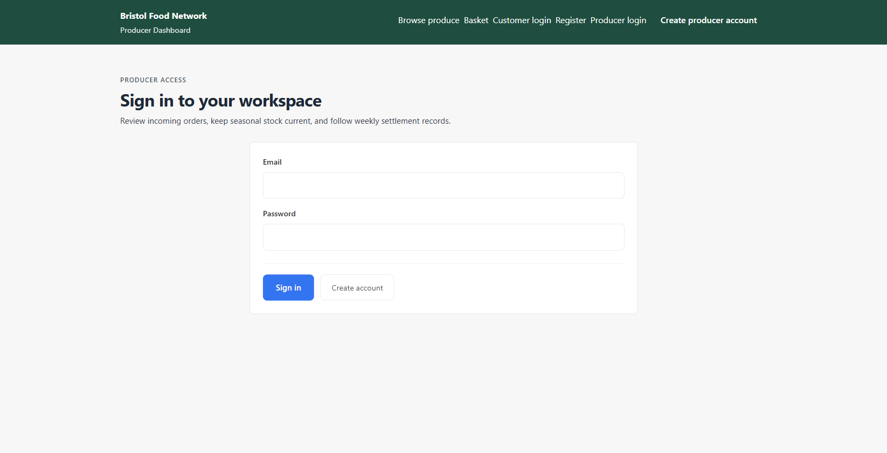 | 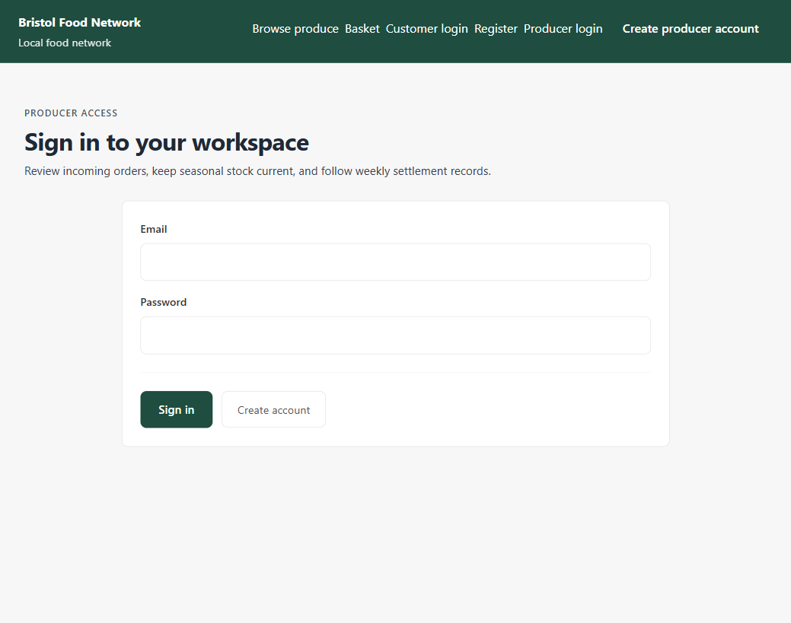 |
| 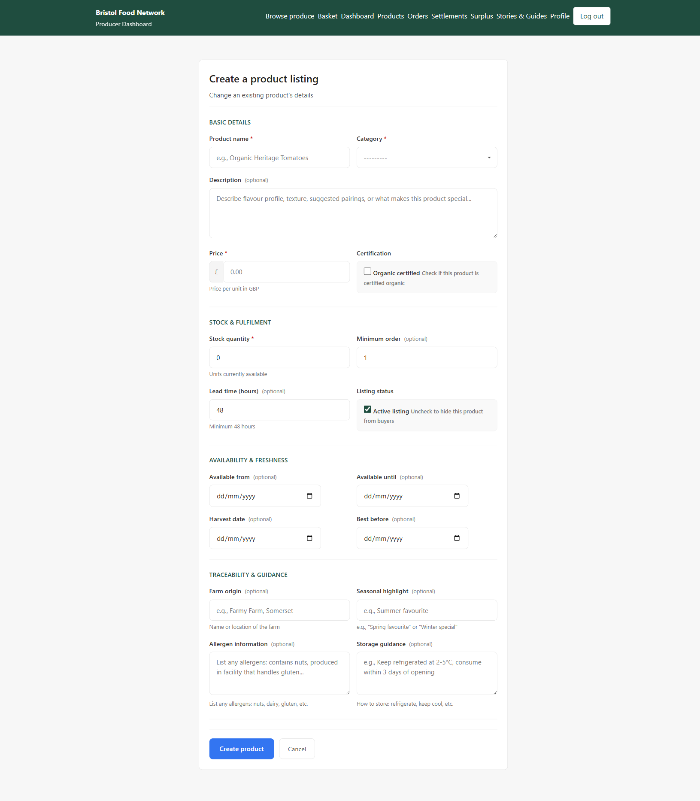 | 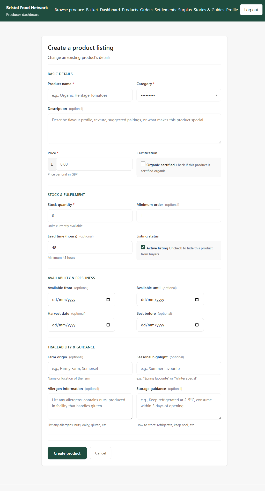 |
| 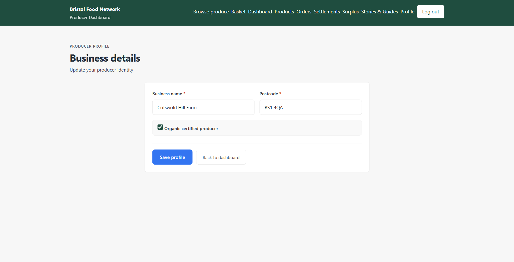 | 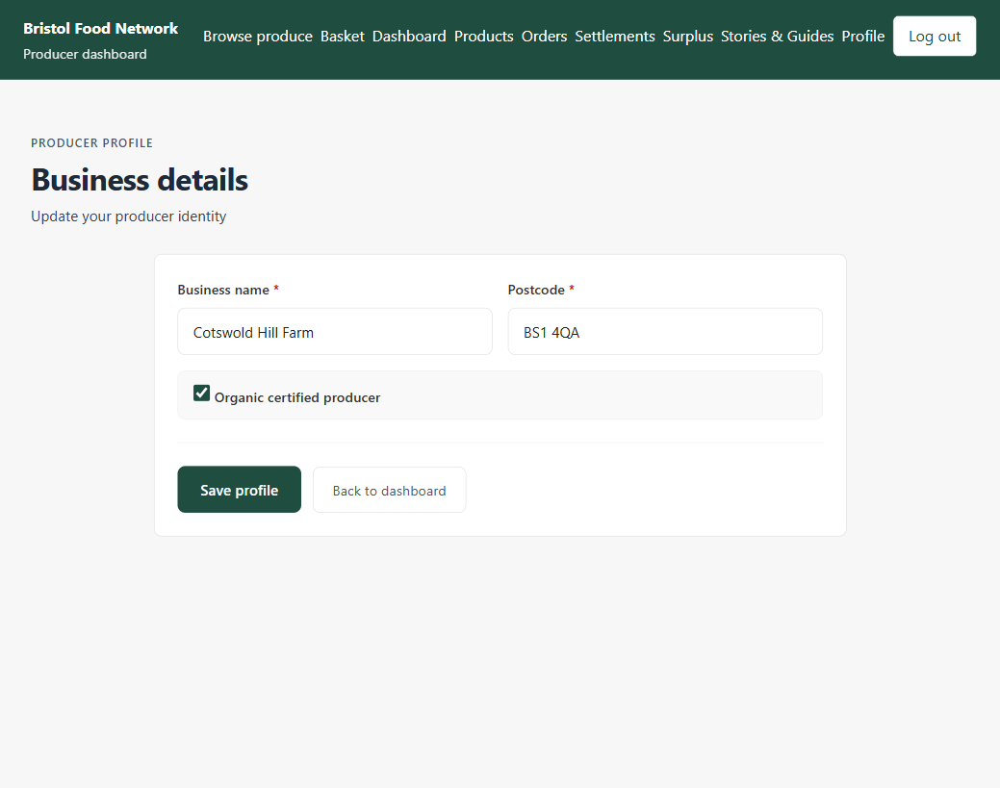 |

```diff
 .form-actions .btn-primary,
 .form-actions button.primary {
-  background: rgba(40, 110, 240, 0.95);
+  background: #1f4d3f;
 }
 .form-actions .btn-primary:hover,
 .form-actions button.primary:hover {
-  background: #286ef0;
+  background: #163a2f;
 }
 .form-actions .btn-primary:focus,
 .form-actions button.primary:focus {
-  outline: 2px solid #286ef0;
+  outline: 2px solid #1f4d3f;
 }
```

---

## Fix 2 — Customer auth screens migrated to design language

[`customer_login.html`](../../core/templates/core/customer_login.html)
and [`customer_register.html`](../../core/templates/core/customer_register.html)
were the only customer-facing templates that didn't get migrated last
session. Naked `<h1>` inside an unstyled card, `<p>`-wrapped form fields,
no `.page-intro` / `.eyebrow`. Rewritten to mirror the producer
login/register structure (`.page-intro` + `.minimal-form-wrap` +
`.form-field` + `.form-actions`), now sharing
[`producer-form.css`](../../core/static/core/css/producer-form.css) for
input + button styling.

| Before | After |
|---|---|
| 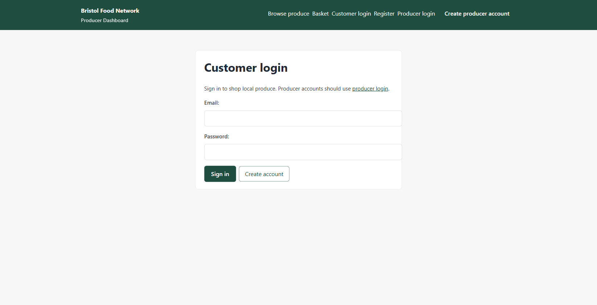 | 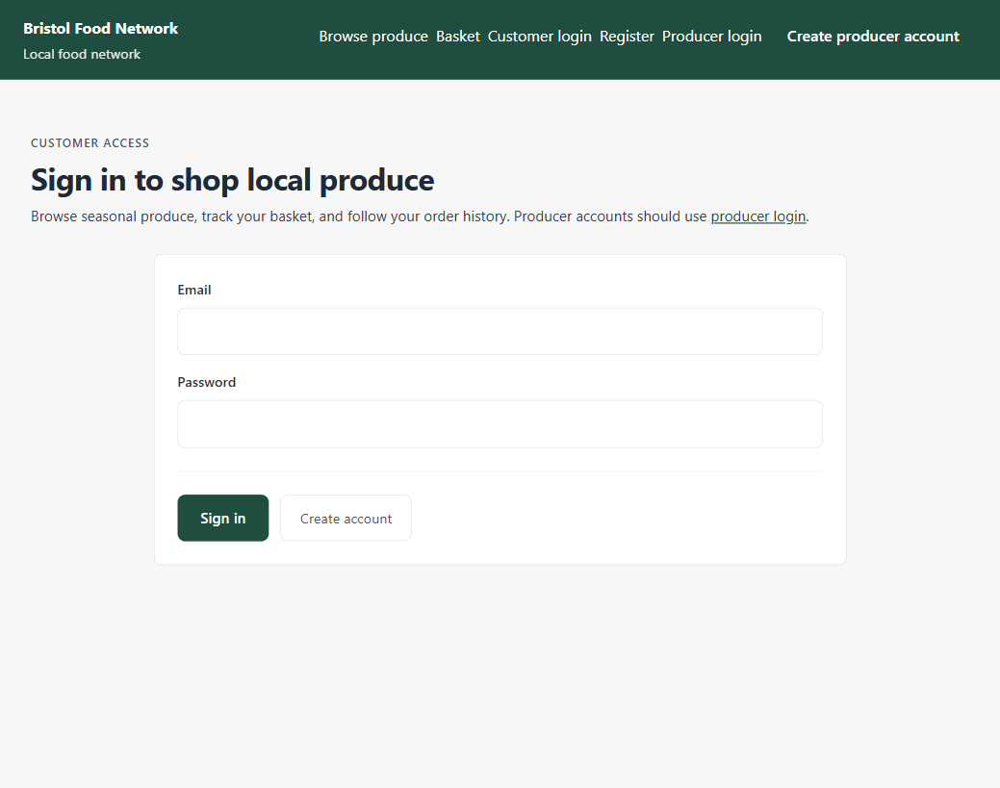 |
| 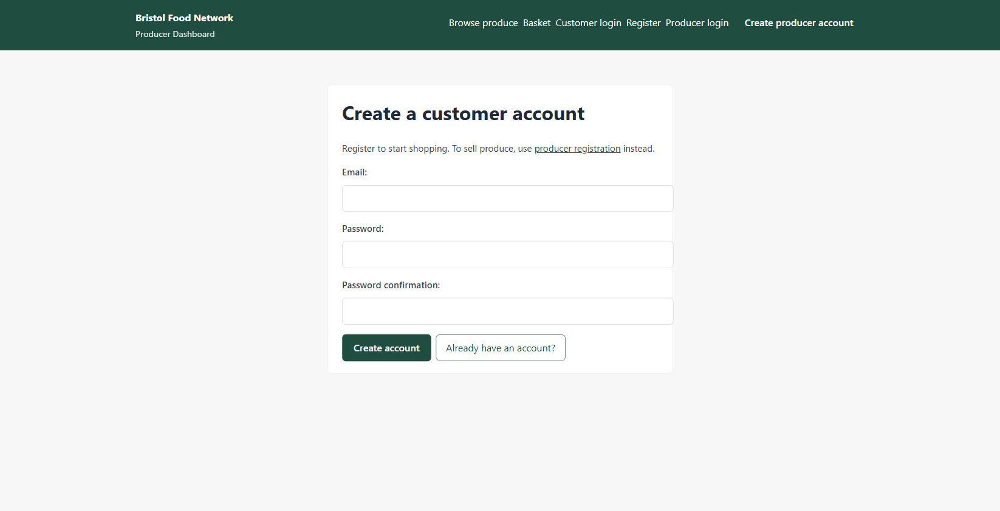 | 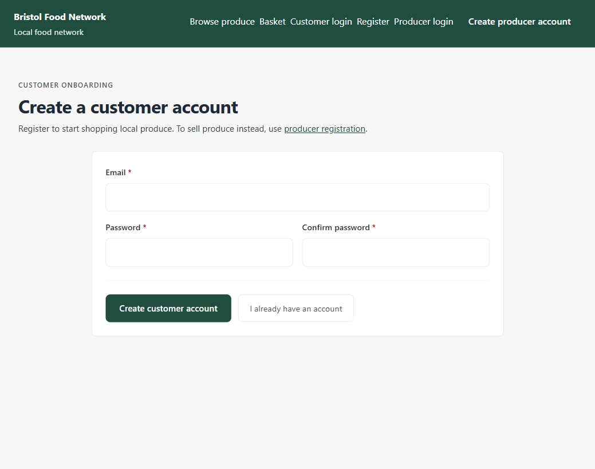 |

Both forms now match the producer auth screens exactly: same eyebrow
treatment, same h1 weight, same form panel, same button styling.

---

## Fix 3 — Header subtitle conditional

[`core/templates/core/base.html:497`](../../core/templates/core/base.html#L497)
hardcoded the brand subtitle to `Producer Dashboard` on every page,
including customer cart/checkout/orders. Replaced with a three-way
conditional driven by the user's role.

```diff
 <a href="" class="brand">
     <strong>Bristol Food Network</strong>
-    <span>Producer Dashboard</span>
+    <span>Producer dashboardCustomer shopLocal food network</span>
 </a>
```

Three resulting subtitle states (all visible in the after-shots above):

| Context | Subtitle |
|---|---|
| Anonymous (e.g. customer login page) | `Local food network` |
| Authenticated customer | `Customer shop` |
| Authenticated producer | `Producer dashboard` |

The `Customer shop` state is shown in [the customer browse capture](images/after/subtitle-customer.png).

---

## Fix 4 — Typo sweep

Five user-visible spelling errors on producer-side pages. Demo audience
would have spotted them.

| File | Before | After |
|---|---|---|
| [`dashboard.html:21`](../../core/templates/core/dashboard.html#L21) | `Surplus Notificaitons` | `Surplus notifications` |
| [`dashboard.html:29`](../../core/templates/core/dashboard.html#L29) | `Items that are yet to be furfilled` | `Items that are yet to be fulfilled` |
| [`dashboard.html:60`](../../core/templates/core/dashboard.html#L60) | `Settlements with commisions calculated` | `Settlements with commissions calculated` |
| [`settlement_list.html:10`](../../core/templates/core/settlement_list.html#L10) | `five percent comission seperated` | `five percent commission separated` |

| Before | After |
|---|---|
| 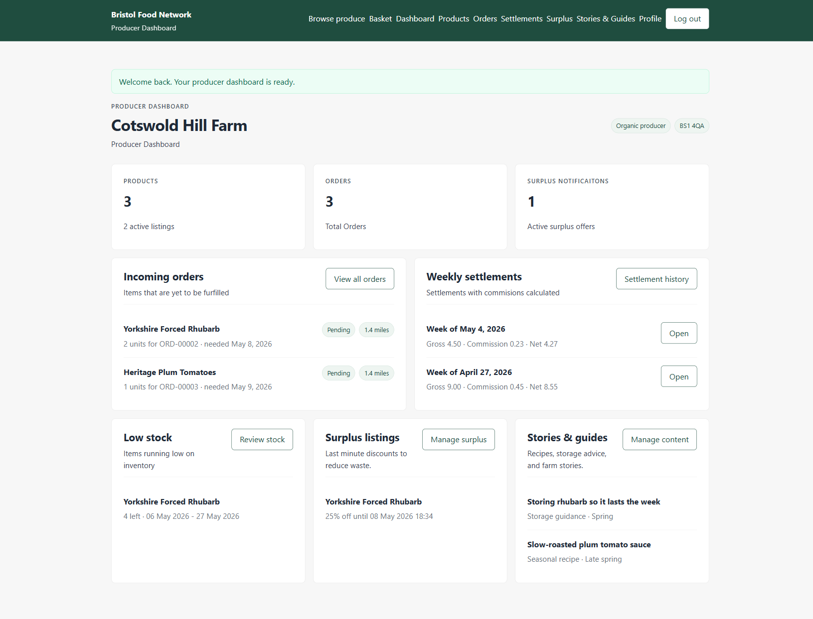 | 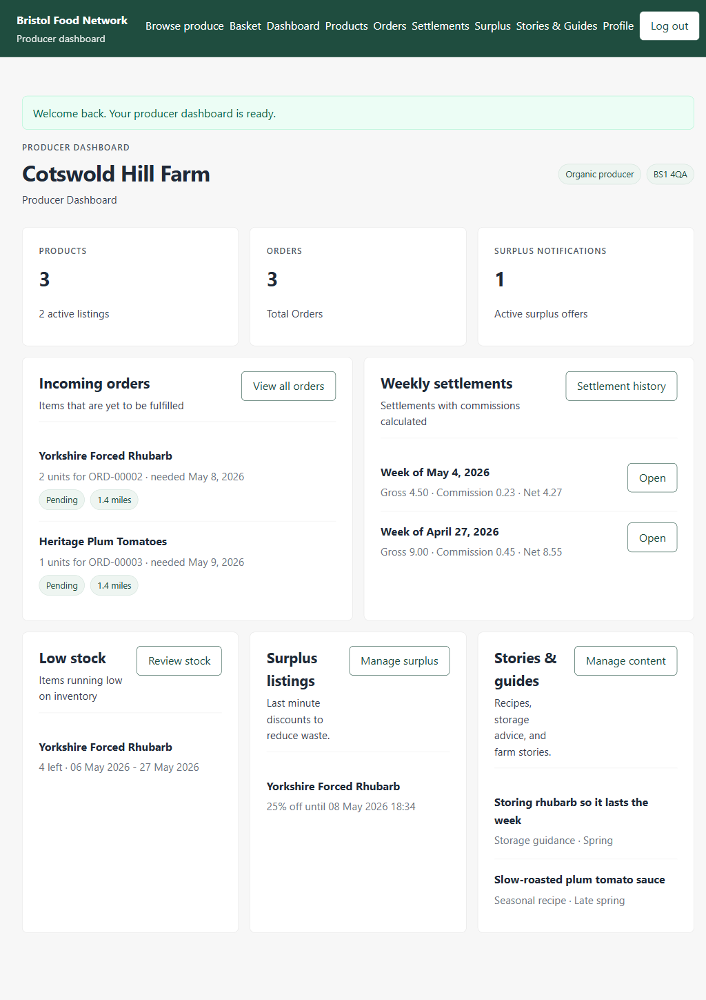 |
| 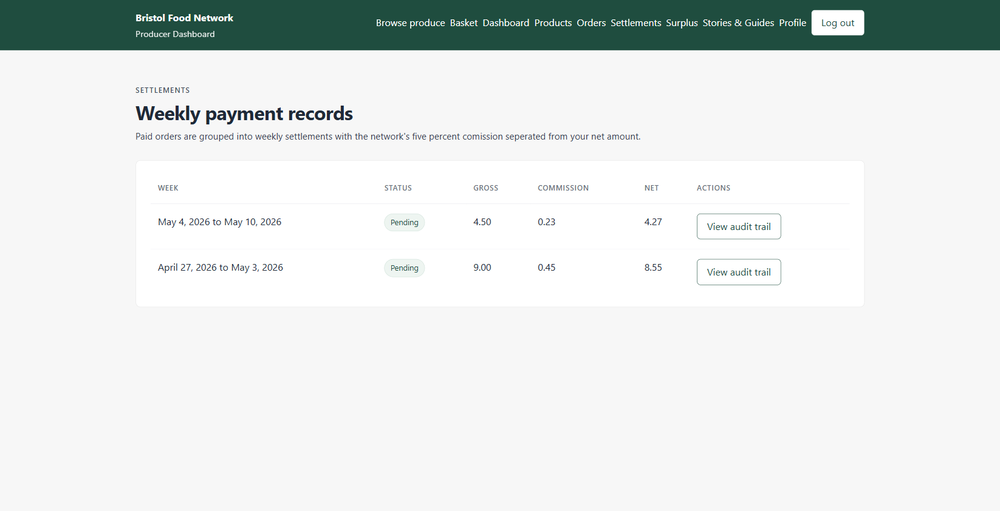 | 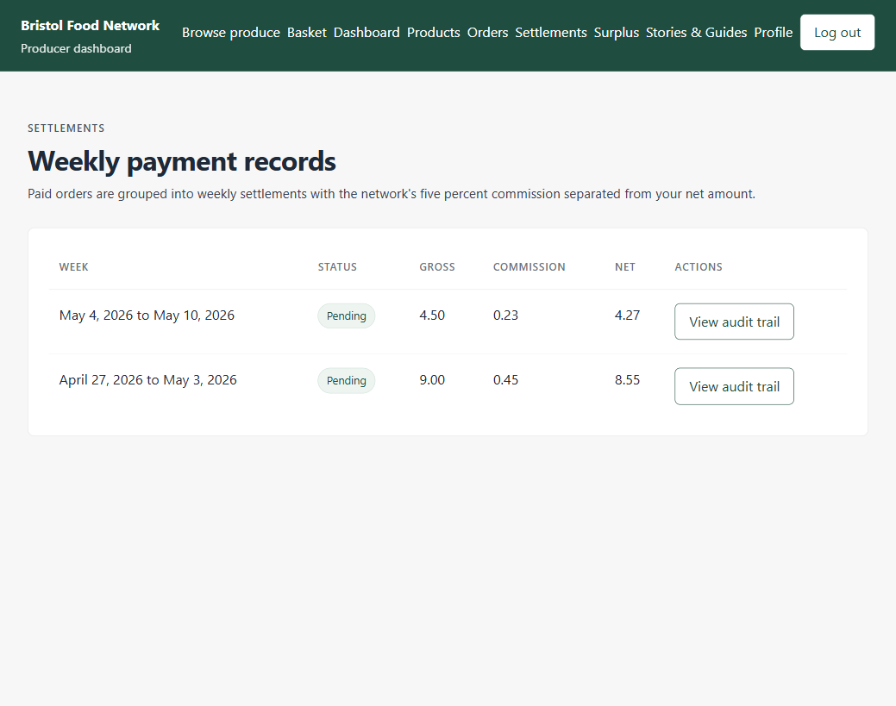 |

---

## Verification

Live verification done with Playwright + Docker against a fresh stack:

1. Bounced container after CSS edit so whitenoise served the new file.
2. Cache-busted the `<link>` tag in the Playwright session to defeat
   Chromium's stylesheet cache (the dev workflow doesn't hash static
   filenames, so browser caches the old file across reloads).
3. Confirmed computed styles: `button.btn-primary` background changed
   from `rgba(40, 110, 240, 0.95)` to `rgb(31, 77, 63)`.
4. Eyeballed every after-screenshot for design-language consistency:
   `.page-intro` + `.eyebrow` + h1 + p, `.minimal-form-wrap` panel,
   green primary CTA, neutral subtitle.

No regressions seen on the dashboard, products list, orders, settlements,
surplus, content, or any of the customer transaction pages.

---

## Follow-up commits

These items were deferred from the first cleanup commit and landed in
follow-ups on the same branch:

### Order references on customer-facing templates (commit `d3feb47`)

`orders/order_list.html`, `orders/order_detail.html`, `checkout/payment.html`,
and `checkout/payment_success.html` now render `{{ order.reference|default:order.id }}`.
Customer order list now reads `ORD-00003` instead of `Order #3`, matching
the producer side.

| Before | After |
|---|---|
|  | 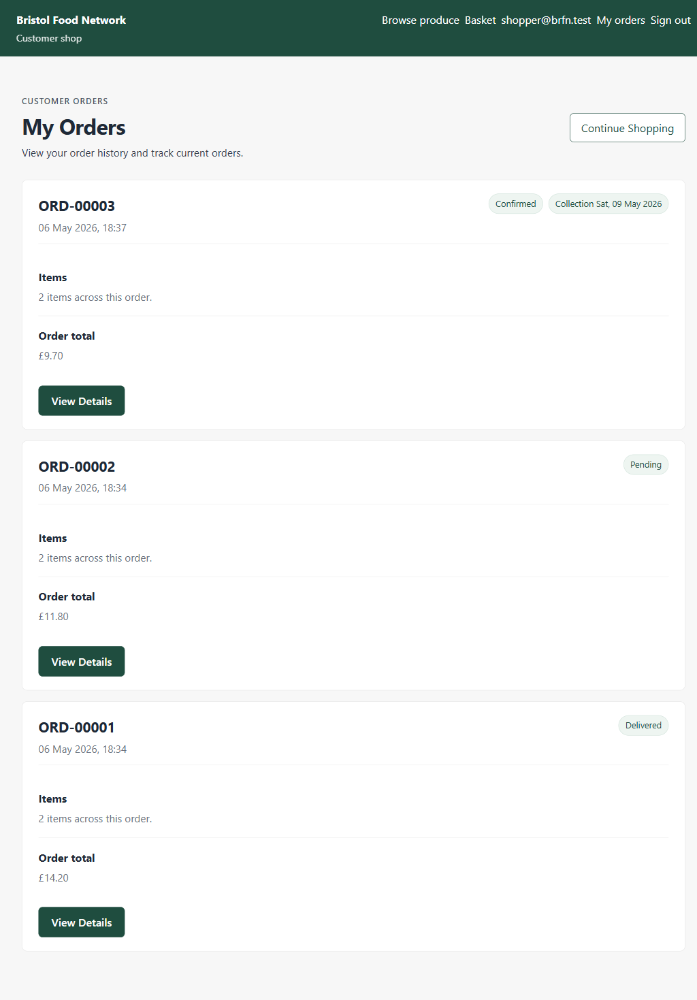 |

### Settlement idempotency fix (commit `d3feb47`)

`sync_producer_settlements` now uses `SettlementEntry.get_or_create` keyed
on `order_item`, and reconciles `OrderItem.settlement` to the existing
entry's settlement when they desync. Previously, an orphaned
`SettlementEntry` would 500 the dashboard with a duplicate-key
`IntegrityError` on every load. Verified by clearing
`OrderItem.settlement` on linked items and reloading: the dashboard
returns 200 and reconciles the link on the way through.

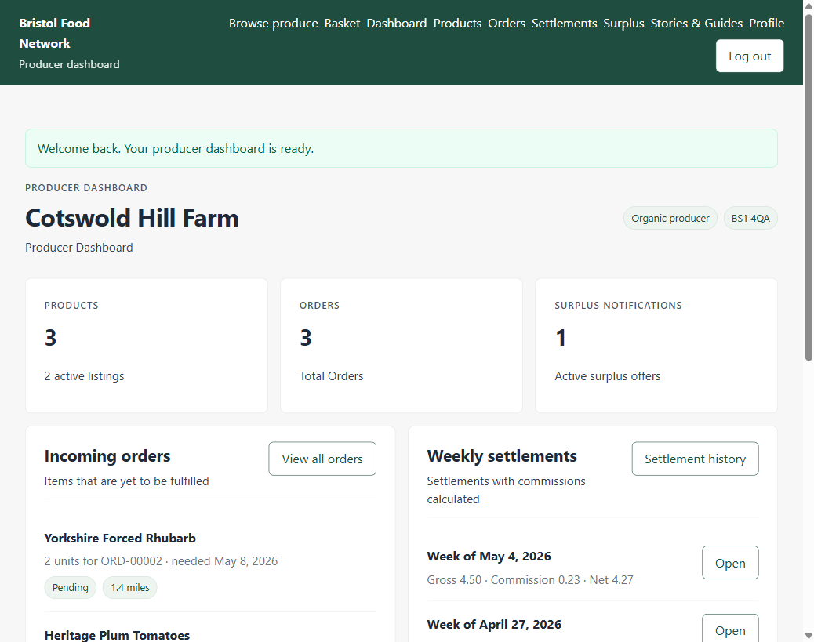

### Payment success page rewrite

`payment_success.html` was a custom centered layout with a green
checkmark, custom green headline, and a mint-green inline-styled "What
Happens Next?" panel. Rewritten to use the same `.page-intro` +
`<article class="card stack">` + `section-title` + `list-reset`
structure every other customer page uses.

| Before | After |
|---|---|
| 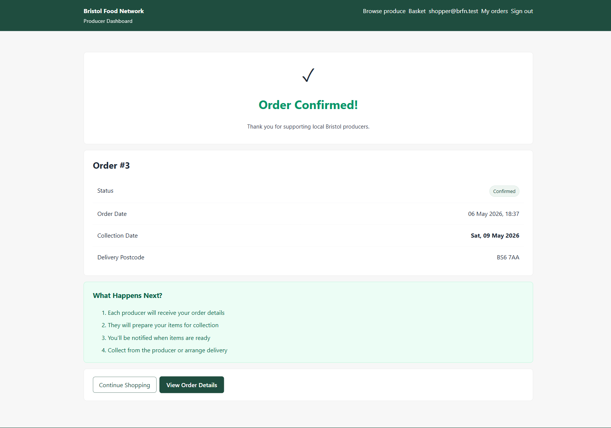 | 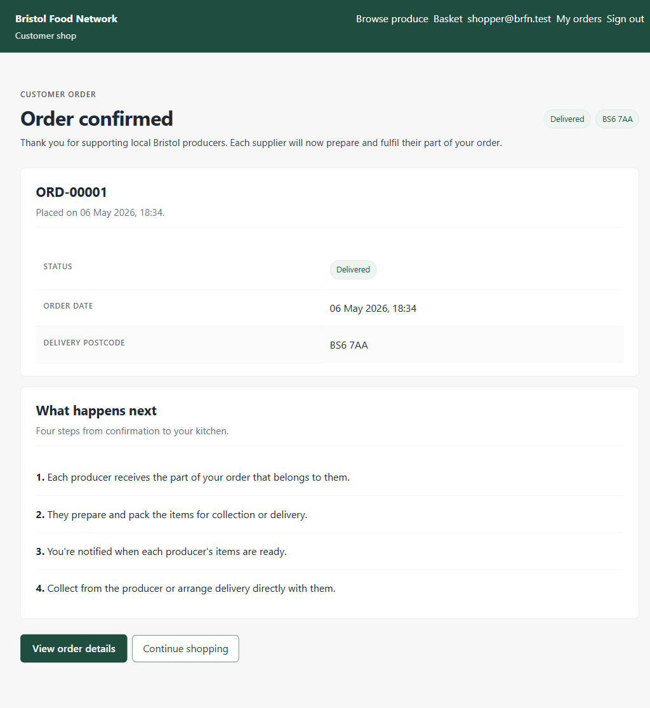 |

---

## Still deferred

- **Dashboard `<p>Producer Dashboard</p>`** — the page-intro paragraph at
  [`dashboard.html:10`](../../core/templates/core/dashboard.html#L10)
  duplicates the eyebrow text immediately above it. Tiny tweak, optional.
- **Customer browse category mismatch** — the customer browse view has a
  hardcoded category list (`Vegetables, Dairy, Bakery, Preserves,
  Seasonal Specialities`) that doesn't match the seeded categories
  (`Fruit`, `Pantry` get hidden silently).
